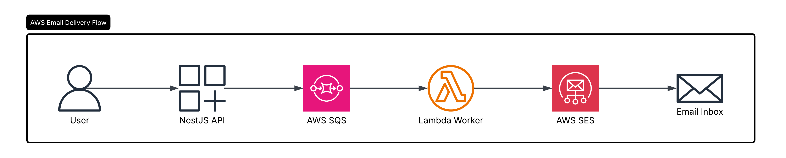
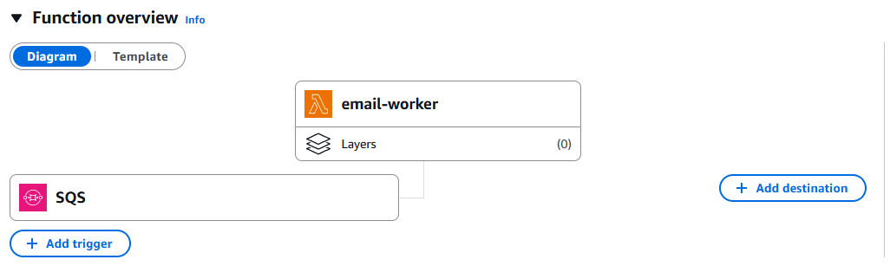

# AWS Async Email Queue System
Asynchronous email processing system built with NestJS and AWS services.

## Architecture Diagram

## Tech Stack
### Backend
- NestJS
- TypeScript
- AWS SDK

### AWS Services
- AWS IAM
- AWS SQS
- AWS Lambda
- AWS SES
- AWS CloudWatch

## Features
- Async email processing
- Queue-based architecture
- Event-driven system
- Serverless worker
- AWS SES email delivery
- Scalable background job processing

## System Flow
### 1.User Signup

Client sends request:
POST /auth/signup

Body
{
  "email": "xxx@gmail.com"
}

### 2.API Pushes Message to SQS
Ex queue message:
{
  "email": "xxx@gmail.com",
  "type": "welcome-email"
}

### 3.Lambda Triggered Automatically
- AWS Lambda listens to SQS queue and processes incoming messages.

### 4.SES Sends Email
- Lambda uses AWS SES to send email asynchronously.

## Installation
### Backend
- cd backend
- npm install
- npm run start:dev

## API Testing

## Cloud Architecture Concepts Used
- Asynchronous Processing
- Queue Systems
- Event-Driven Architecture
- Serverless Computing
- Background Workers
- Decoupled Services

